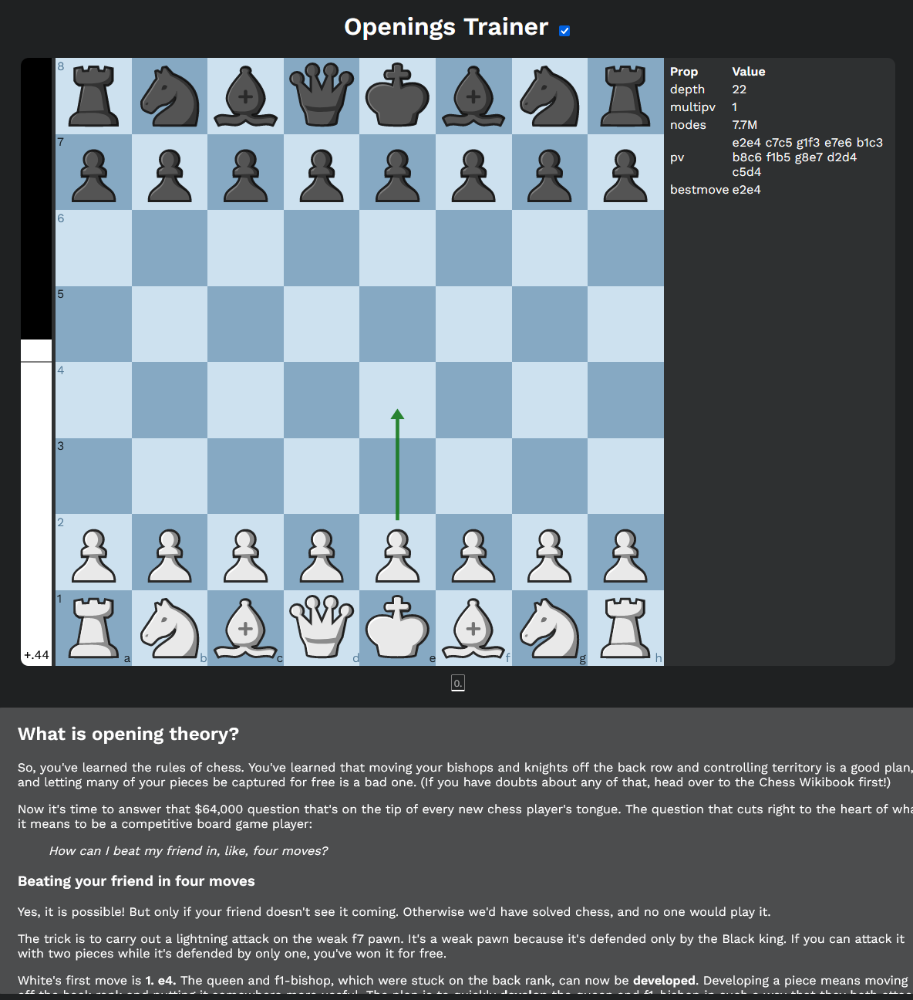

# ♟️ChessWeb

ChessWeb is a web chess interface useful for studying chess openings. It runs [Stockfish 15 WASM](https://github.com/lichess-org/stockfish.wasm) in the browser and shows the output on the right side (use a powerful computer to get faster evaluations). It allows arrows to be drawn on the board, as well as scrolling the mouse wheel to traverse the game tree.

The position in the board is loaded onto the bottom panel for further reading about the desired opening. It uses Wikipedia's API to fetch information about the current position.



## Usage

The local dev command is:
```
npm run dev
```

The remote build command is:
```
npm run build
```

## Tools

- Webpack for bundling
- Typescript
- Stockfish 15 WASM
- Tatiana chess pieces (the best Lichess set)
